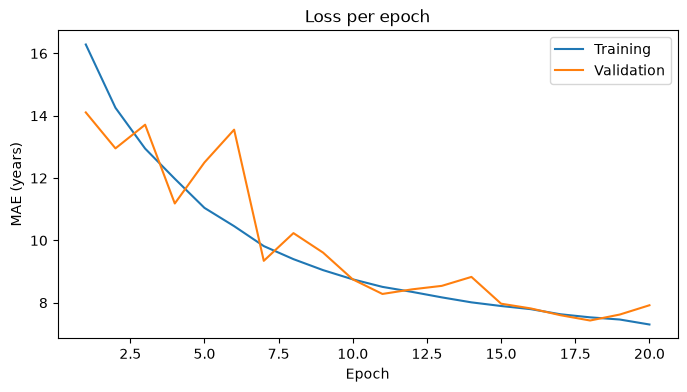

# Age Estimation with a CNN

A small convolutional neural network that estimates a person's age from a face image.
Trained on the [UTKFace](https://susanqq.github.io/UTKFace/) data set (about 23,700 face
images, ages 1 to 116) with PyTorch and a hand-written training loop.

## Project structure

```
age-estimation-cnn/
├── src/age_estimation/
│   ├── config.py      paths and hyperparameters
│   ├── data.py        download, labels, Dataset and DataLoader
│   ├── model.py       CNN architecture
│   ├── train.py       training loop and evaluation
│   └── predict.py     prediction for a single image
├── notebooks/
│   └── age_regression_cnn.ipynb   walkthrough with plots
├── tests/
├── pyproject.toml     dependencies
└── data/, models/, reports/       created locally, not in Git
```

## Setup

Requires [uv](https://docs.astral.sh/uv/).

```
git clone https://github.com/KaiRiegler/Age-estimation.git
cd Age-estimation
uv sync
```

`uv sync` installs PyTorch with CUDA support on Windows and Linux (configured in
`pyproject.toml`). Check that the GPU is found:

```
uv run python -c "import torch; print(torch.__version__, torch.cuda.is_available())"
```

Without an NVIDIA GPU everything still runs, just on the CPU.

## Usage

```
uv run src/age_estimation/data.py                        # download and extract UTKFace into data/ (107 MB)
uv run src/age_estimation/train.py                       # train, saves weights to models/
uv run src/age_estimation/train.py --num-workers 0       # if parallel data loading causes trouble
uv run src/age_estimation/predict.py <path/to/face.jpg>  # predict the age for one image
uv run jupyter lab                                       # open the notebook
uv run pytest                                            # run the tests
```

## Model

| Layer | Output |
|---|---|
| Conv2d, 8 filters, 5x5, stride 4, ReLU | 8 x 49 x 49 |
| Conv2d, 16 filters, 5x5, stride 4, ReLU | 16 x 12 x 12 |
| Flatten + Dropout 0.2 | 2304 |
| Linear 128, ReLU | 128 |
| Linear 64, ReLU | 64 |
| Linear 1 | 1 (age in years) |

Input: 200 x 200 RGB image scaled to [0, 1]. Loss: mean absolute error (MAE),
optimizer: RMSprop. Data split: 80 % training, 10 % validation, 10 % test.

## Results

Trained for 20 epochs with the default settings (batch size 64, learning rate 0.001, seed 42)
on an NVIDIA RTX 2080 Super.

| Model | Test MAE (years) |
|---|---|
| Baseline (always predicting the median age) | 15.42 |
| **CNN** | **7.58** |

On average, the predicted age is off by about 7.6 years on images the model has never seen,
roughly half the error of the baseline.



Training and validation error stay close together, so the model is not overfitting.
The training error was still decreasing after 20 epochs, so longer training or a larger
network would likely improve the result further.

## Data

The data set is not part of this repository. UTKFace is available for non-commercial
research purposes only.
